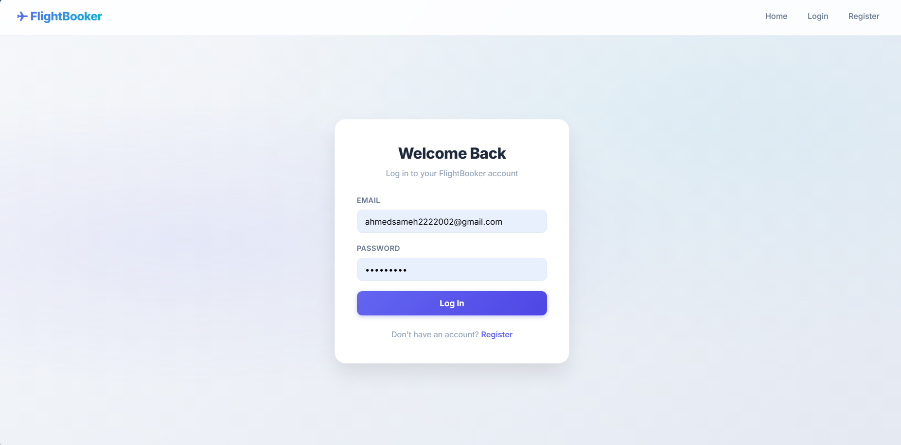
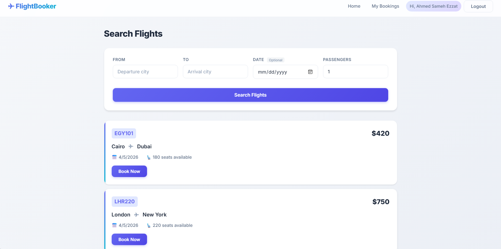
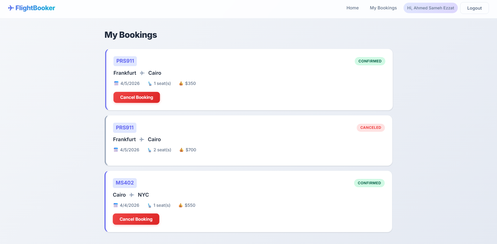
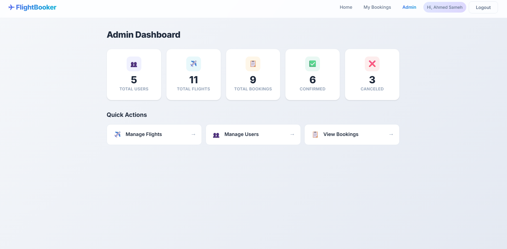
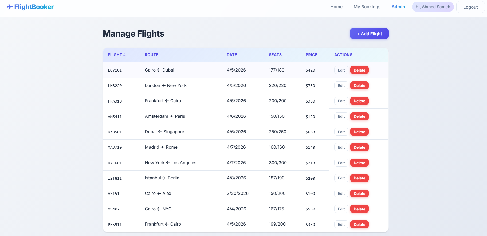
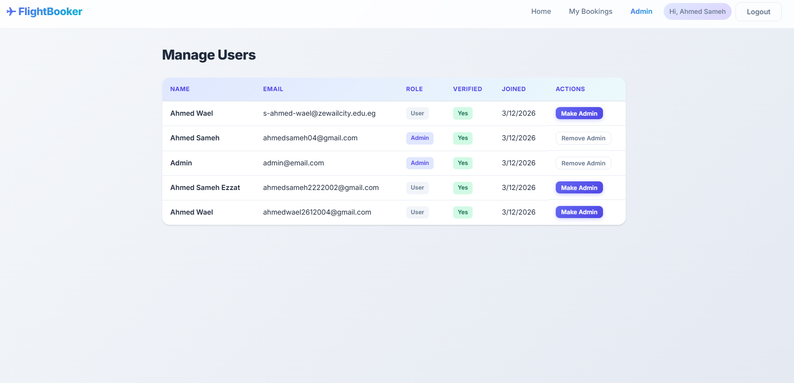
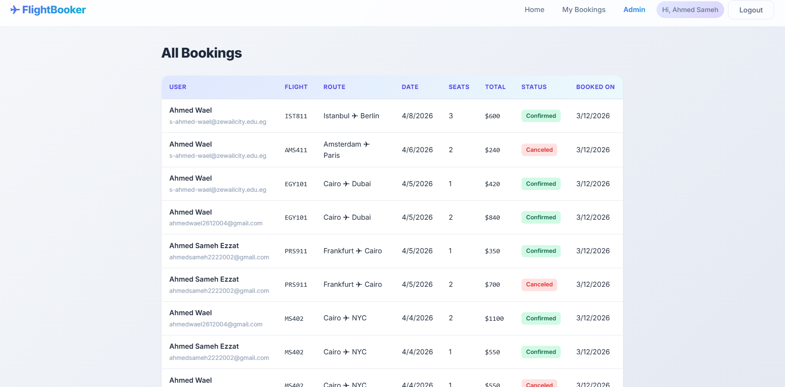

<div align="center">

# ✈️ Flight Booking System

A full-stack flight booking application built with **React** and **Node.js** that allows users to search, book, and manage flights with secure JWT authentication and email verification.


</div>

---

## 📋 Table of Contents

- [Features](#-features)
- [Tech Stack](#-tech-stack)
- [Project Structure](#-project-structure)
- [Getting Started](#-getting-started)
- [Environment Variables](#-environment-variables)
- [API Reference](#-api-reference)
- [Admin Setup](#-admin-setup)
- [Screenshots](#-screenshots)
  - [User Pages](#user-pages)
  - [Admin Pages](#admin-pages)

---

## ✨ Features

### User Features
- **Account Registration** with email verification (6-digit code)
- **Secure Login** with JWT-based authentication
- **Flight Search** with city autocomplete suggestions
- **Optional Date Filtering** — search all dates or a specific one
- **Seat-Based Booking** with real-time availability
- **Booking History** — view and cancel bookings
- **Resend Verification** — request a new code if it expires

### Admin Features
- **Dashboard Statistics** (total users, flights, bookings)
- **Flight Management** — create, update, and delete flights
- **User Management** — view all users and update roles
- **Booking Oversight** — view all bookings in the system

### UI / UX
- **Framer Motion Animations** — page transitions, staggered lists, hover effects
- **Responsive Design** — works on desktop, tablet, and mobile
- **Glassmorphism Navbar** with backdrop blur
- **Premium Design System** with CSS custom properties

---

## 🛠 Tech Stack

| Layer      | Technologies                                                  |
|------------|---------------------------------------------------------------|
| **Frontend** | React 19, React Router 7, Axios, Framer Motion, Vite        |
| **Backend**  | Node.js, Express, Mongoose, JWT, bcryptjs                   |
| **Database** | MongoDB                                                     |
| **Email**    | Mailtrap / Nodemailer                                       |
| **Auth**     | JWT tokens (7-day expiry), bcrypt password hashing          |

---

## 📁 Project Structure

```
Flight-Booking-System/
├── backend/
│   ├── config/
│   │   └── db.js                 # MongoDB connection
│   ├── controllers/
│   │   ├── adminController.js    # Admin dashboard & management
│   │   ├── authController.js     # Register, login, verify email
│   │   ├── bookingController.js  # Create, view, cancel bookings
│   │   └── flightController.js   # CRUD flights, search
│   ├── middleware/
│   │   └── authMiddleware.js     # JWT protect & admin guard
│   ├── models/
│   │   ├── Booking.js
│   │   ├── Flight.js
│   │   └── User.js
│   ├── routes/
│   │   ├── adminRoutes.js
│   │   ├── authRoutes.js
│   │   ├── bookingRoutes.js
│   │   └── flightRoutes.js
│   ├── script/
│   │   └── adminScript.js        # Seed default admin account
│   ├── utils/
│   │   └── emailService.js       # Mailtrap email sender
│   ├── server.js
│   └── package.json
│
├── frontend/
│   ├── src/
│   │   ├── components/
│   │   │   ├── BookingCard.jsx
│   │   │   ├── ErrorMessage.jsx
│   │   │   ├── FlightCard.jsx
│   │   │   ├── FlightSearchForm.jsx
│   │   │   ├── Loader.jsx
│   │   │   ├── Navbar.jsx
│   │   │   ├── PageTransition.jsx
│   │   │   └── ProtectedRoute.jsx
│   │   ├── context/
│   │   │   └── AuthContext.jsx    # Global auth state
│   │   ├── pages/
│   │   │   ├── BookingHistoryPage.jsx
│   │   │   ├── HomePage.jsx
│   │   │   ├── LoginPage.jsx
│   │   │   ├── RegisterPage.jsx
│   │   │   └── VerifyEmailPage.jsx
│   │   ├── services/
│   │   │   ├── api.js             # Axios instance + JWT interceptor
│   │   │   ├── authService.js
│   │   │   ├── bookingService.js
│   │   │   └── flightService.js
│   │   ├── App.jsx
│   │   ├── App.css
│   │   └── main.jsx
│   ├── vite.config.js
│   └── package.json
│
└── README.md
```

---

## 🚀 Getting Started

### Prerequisites

- **Node.js** v18+
- **MongoDB** (local instance or [MongoDB Atlas](https://www.mongodb.com/atlas))
- **npm** or **yarn**

### 1. Clone the Repository

```bash
git clone https://github.com/shadow9-1-1/Flight-Booking-System.git
cd Flight-Booking-System
```

### 2. Backend Setup

```bash
cd backend
npm install
```

Create a `.env` file in the `backend/` directory (see [Environment Variables](#-environment-variables)).

```bash
# Seed the admin account
npm run script:admin

# Start the server
npm run dev
```

The API will run on `http://localhost:5000`.

### 3. Frontend Setup

```bash
cd frontend
npm install
```

Create a `.env` file in the `frontend/` directory:

```env
VITE_API_URL=http://localhost:5000/api
```

```bash
npm run dev
```

The app will run on `http://localhost:5173`.

---

## 🔐 Environment Variables

### Backend (`backend/.env`)

| Variable         | Description                   | Example                              |
|------------------|-------------------------------|--------------------------------------|
| `PORT`           | Server port                   | `5000`                               |
| `NODE_ENV`       | Environment mode              | `development`                        |
| `MONGO_URI`      | MongoDB connection string     | `mongodb://localhost:27017/flightdb` |
| `JWT_SECRET`     | Secret key for JWT signing    | `your_jwt_secret_key`               |
| `MAILTRAP_TOKEN` | Mailtrap API token for emails | `your_mailtrap_token`               |

### Frontend (`frontend/.env`)

| Variable       | Description     | Example                       |
|----------------|-----------------|-------------------------------|
| `VITE_API_URL` | Backend API URL | `http://localhost:5000/api`   |

---

## 📡 API Reference

### Authentication

| Method | Endpoint                       | Access | Description              |
|--------|--------------------------------|--------|--------------------------|
| POST   | `/api/auth/register`           | Public | Register a new user      |
| POST   | `/api/auth/login`              | Public | Login and get JWT token  |
| POST   | `/api/auth/verify-email`       | Public | Verify email with code   |
| POST   | `/api/auth/resend-verification`| Public | Resend verification code |

### Flights

| Method | Endpoint               | Access | Description                     |
|--------|------------------------|--------|---------------------------------|
| GET    | `/api/flights`         | Public | Get all flights (with filters)  |
| GET    | `/api/flights/search`  | Public | Search flights (from, to, date, seats) |
| POST   | `/api/flights`         | Admin  | Create a new flight             |
| PUT    | `/api/flights/:id`     | Admin  | Update a flight                 |
| DELETE | `/api/flights/:id`     | Admin  | Delete a flight                 |

### Bookings

| Method | Endpoint                   | Access    | Description           |
|--------|----------------------------|-----------|-----------------------|
| POST   | `/api/bookings`            | Protected | Book a flight         |
| GET    | `/api/bookings/my-bookings`| Protected | Get user's bookings   |
| PUT    | `/api/bookings/:id`        | Protected | Cancel a booking      |

### Admin

| Method | Endpoint                     | Access | Description          |
|--------|------------------------------|--------|----------------------|
| GET    | `/api/admin/stats`           | Admin  | Dashboard statistics  |
| GET    | `/api/admin/users`           | Admin  | List all users        |
| GET    | `/api/admin/bookings`        | Admin  | List all bookings     |
| GET    | `/api/admin/flights`         | Admin  | List all flights      |
| PATCH  | `/api/admin/users/:id/role`  | Admin  | Update user role      |

---

## 👤 Admin Setup

Run the seed script to create the default admin account:

```bash
cd backend
npm run script:admin
```

**Default admin credentials:**
| Field    | Value             |
|----------|-------------------|
| Email    | `admin@email.com` |
| Password | `admin123`        |

> **Note:** Change these credentials in production.

---

## 📸 Screenshots

### User Pages

| Page | Preview |
|------|---------|
| Login |  |
| Flight Search |  |
| Booking History |  |

### Admin Pages

| Page | Preview |
|------|---------|
| Admin Dashboard |  |
| Admin Flights |  |
| Admin Users |  |
| Admin Bookings |  |

> **Tip:** To add screenshots, log in as admin (`admin@email.com` / `admin123`), take screenshots of each page, save them in the project root, and name them to match the filenames above.

---

</div>
##👥 Development Team

<p align="center">
<table align="center" style="margin:0 auto; text-align:center;">
<tr>
<th align="center">Full-Stack Developer</th>
<th align="center">Full-Stack Developer</th>
</tr>
<tr>

<td align="center"><br>Ahmed Sameh</td>
<td align="center"><br>Ahmed Wael</td>
</tr>
